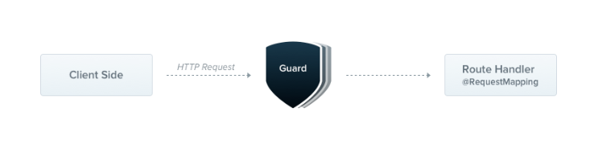
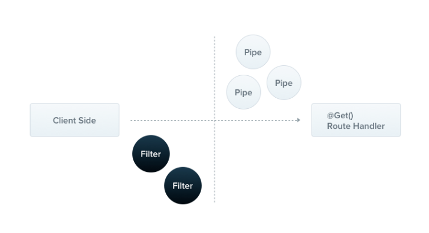
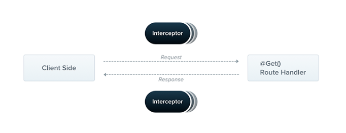
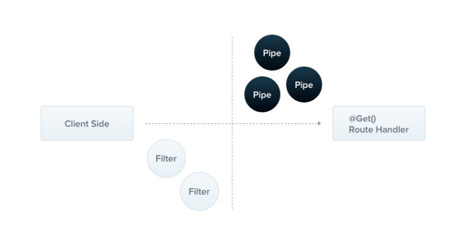

# 「拖拽生成小程序画图配置」服务端

服务端使用 [NestJS](https://nestjs.com/) 编写，下面这部分内容，我将简单分享 NestJS 在服务端的一些实践经验，并介绍 NestJS 的部分功能及其在服务端项目中的应用。

## NestJS 是什么

[NestJS](https://nestjs.com/) 是一个基于 Node.js 的**高效**、**可扩展**和**易于维护**的后端开发框架，它使用现代化的 JavaScript 和 TypeScript 语言来构建 Web 应用程序。

NestJS 提供了一种模块化的方式来组织代码，并使用**依赖注入**的方式来管理组件之间的依赖关系。它还提供了一组强大的工具和库，用于处理 HTTP 请求、数据库访问、身份验证和授权等常见任务。

## NestJS 的基本功能

### 模块化架构

NestJS 使用模块化架构来组织代码。每个模块都是一个独立的单元，它包含了一组相关的**组件**、**控制器**和**服务**。这种模块化的方式使得代码更易于维护和扩展。

在我们的项目中，我们使用模块来组织不同的功能，例如用户管理、项目管理和画板管理等。每个模块都有自己的控制器和服务，它们负责处理 HTTP 请求和业务逻辑。

以下是一个示例模块的代码：

```ts
import { Module } from '@nestjs/common';
import { UserController } from './user.controller';
import { UserService } from './user.service';

@Module({
  controllers: [UserController],
  providers: [UserService],
})
export class UserModule {}
```

在上面的示例中，我们定义了一个名为 `UserModule` 的模块，它包含了一个 `UserController` 和一个 `UserService`。`UserController` 负责处理 HTTP 请求，`UserService` 负责处理业务逻辑。我们使用 `@Module()` 装饰器来定义模块，并使用 `controllers` 和 `providers` 属性来指定控制器和服务。

### 依赖注入

NestJS 使用依赖注入来管理组件之间的依赖关系。依赖注入是一种设计模式，它使得组件之间的依赖关系更加松散，从而使得代码更易于维护和测试。

在我们的项目中，我们使用依赖注入来管理服务之间的依赖关系。例如，我们的用户服务依赖于数据库服务和加密服务。通过使用依赖注入，我们可以轻松地将这些服务注入到用户服务中。

以下是一个示例服务的代码：

```ts
import { Injectable } from '@nestjs/common';
import { UserService } from './user.service';
import { DatabaseService } from './database.service';
import { EncryptionService } from './encryption.service';

@Injectable()
export class UserService {
  constructor(
    private readonly databaseService: DatabaseService,
    private readonly encryptionService: EncryptionService,
  ) {}

  async createUser(name: string, password: string) {
    const encryptedPassword = await this.encryptionService.encrypt(password);
    const user = await this.databaseService.createUser(name, encryptedPassword);
    return user;
  }
}
```

在上面的示例中，我们定义了一个名为 `UserService` 的服务，它依赖于 `DatabaseService` 和 `EncryptionService`。我们使用 `@Injectable()` 装饰器来定义服务，并在构造函数中注入依赖项。

### 控制器和路由

NestJS 使用控制器和路由来处理 HTTP 请求。控制器是一个类，它包含了一组处理 HTTP 请求的方法。路由是一个映射表，它将 HTTP 请求的 URL 映射到控制器的方法上。

以下是一个示例控制器和路由的代码：

```ts
import { Controller, Get, Post } from '@nestjs/common';

@Controller('user')
export class UserController {
  @Get('list')
  findAll(): string {
    return '/user/list 接口的响应';
  }

  @Post('create')
  create(): string {
    return '/user/create 接口的响应';
  }
}
```

在上面的示例中，我们定义了一个名为 `UserController` 的控制器，它包含了两个处理 HTTP 请求的方法：`findAll()` 和 `create()`。我们使用 `@Controller()` 装饰器来定义控制器，并使用 `@Get()` 和 `@Post()` 装饰器来定义 HTTP 请求的方法和路由。在这个例子中，`findAll()` 方法处理 `GET /user/list` 请求，`create()` 方法处理 `POST /user/create` 请求。

### 守卫

守卫是一种用于保护路由的中间件。它们可以用于实现各种功能，例如身份验证、授权、日志记录等。



守卫可以分为两种类型：全局守卫和局部守卫。全局守卫会应用到所有的路由上，而局部守卫只会应用到指定的路由上。

在 Nest.js 中，守卫是通过实现 `CanActivate` 接口来创建的。这个接口包含了一个 `canActivate` 方法，用于判断是否允许访问路由。在 `canActivate` 方法中，你可以对请求进行任何处理，例如检查用户是否已登录、检查用户是否有权限访问该路由等。

以下是一个示例守卫的代码：

```ts
@Injectable()
export class AuthGuard implements CanActivate {
  canActivate(
    context: ExecutionContext,
  ): boolean | Promise<boolean> | Observable<boolean> {
    const request = context.switchToHttp().getRequest();
    return validateRequest(request);
  }
}
```

在这个示例中，我们创建了一个名为 `AuthGuard` 的守卫，它会检查请求是否包含有效的身份验证信息。如果请求包含有效的身份验证信息，则允许访问路由，否则拒绝访问路由。

要使用守卫，你需要将它们注册到模块或控制器中。你可以使用 `@UseGuards` 装饰器将守卫应用到控制器或方法上，也可以在 Module 中的 `providers` 中使用 `APP_GUARD` 常量注册全局守卫。

```ts
{
  provide: APP_GUARD,
  useClass: MyAuthGuard,
}
```

## NestJS 在项目中的实践

### 数据库(MongoDB & TypeORM)

在我们的项目中，我们使用 MongoDB 作为数据库，并使用 TypeORM 来访问数据库。TypeORM 是一个 ORM(Object-Relational Mapping) 框架，它提供了一种现代化的方式来访问数据库。

> ORM(Object-Relational Mapping) 是一种将对象模型和关系数据库之间的映射进行自动化的技术。

以下是一个示例 TypeORM 实体的代码：

```ts
import { Entity, Column, ObjectIdColumn } from 'typeorm';

@Entity()
export class User {
  @ObjectIdColumn()
  id: string;

  @Column()
  name: string;
}
```

在上面的示例中，我们定义了一个名为 `User` 的 TypeORM 实体，它映射到 MongoDB 中的一个集合。我们使用 `@Entity()` 装饰器来定义实体，并使用 `@Column()` 和 `@ObjectIdColumn()` 装饰器来定义实体的属性。

### 授权相关

#### 登录授权

在我们的项目中，我们使用 JWT(JSON Web Token) 和 Passport 来进行身份验证和授权。JWT 是一种现代化的身份验证和授权方式，它使用 JSON 格式的令牌来验证用户身份和授权访问。Passport 是一个身份验证模块，它提供了一些策略来处理身份验证。

当用户登录成功后，JWT 鉴权的流程如下：

1. 服务器生成一个 JWT 令牌，并将用户的 `id` 加密到令牌中。
2. 服务器将 JWT 令牌发送给客户端，客户端将 JWT 令牌保存在本地。
3. 客户端在每次请求时，将 JWT 令牌添加到请求头中的 `Authorization` 字段中。
4. 服务器使用 Passport 中的 `AuthGuard` 路由守卫来拦截请求，并使用 Passport 的 JWT 策略来验证令牌的有效性。

   - 路由守卫中还做了一个判断：如果是被 `@Public` 装饰的接口，则直接放行。

5. 如果 JWT 令牌有效，则允许请求通过，并将用户信息放到请求信息中；否则返回 401 未授权错误。

#### 自定义权限验证

在用户的信息中，有一个 `permissions` 字段用于标识该用户对哪些字段具有访问权限，以便于做一些更细粒度的权限控制。

为了验证用户权限，我们使用了自定义的权限验证逻辑：

- 封装了 `@Permission` 装饰器，用于装饰那些需要特定权限才能访问的路由。
- 编写了用于验证权限的路由守卫，在守卫中验证用户是否拥有该路由的访问权限，如果没有将会返回 403 拒绝访问错误。

### 异常过滤器

过滤器（Filter）是一种中间件，用于在请求处理过程中拦截和处理异常。当应用程序抛出异常时，过滤器可以捕获这些异常，并根据需要进行处理，例如记录日志、返回错误响应等。



在我们的项目中，使用了**异常过滤器**的来对 HTTP 请求中抛出的异常进行拦截和处理，将异常信息包装成一个对象，这个对象包含了状态码、错误信息、请求路径等信息。

```ts
const msgMap = {
  400: '请求参数错误',
  401: '未授权',
  403: '禁止访问',
  404: '资源不存在',
  500: '服务器内部错误',
};

/** 异常过滤器 */
@Catch(HttpException)
export class HttpFilter implements ExceptionFilter {
  catch(exception: HttpException, host: ArgumentsHost) {
    console.log('HttpFilter catch: ', exception.getResponse());
    const ctx = host.switchToHttp();
    const request = ctx.getRequest<Request>();
    const response = ctx.getResponse<Response>();

    const status = exception.getStatus();

    response.status(200).json({
      code: status,
      data: null,
      message: msgMap[status] || exception.message || '系统繁忙，请稍后再试～',
      success: false,
      path: request.url,
    });
  }
}
```

### 响应拦截器

拦截器是一种中间件，用于在请求处理过程中拦截请求和响应，并对它们进行处理。拦截器可以用于实现各种功能，例如日志记录、身份验证、缓存、异常处理等。



拦截器可以分为两种类型：**请求拦截器**和**响应拦截器**。请求拦截器用于拦截请求并对其进行处理，而响应拦截器用于拦截响应并对其进行处理。

在我们的项目中，使用了**响应拦截器**来对 HTTP 响应进行拦截和处理，将响应数据包装成一个对象，这个对象包含了响应数据、状态码、成功标志和消息等信息。

```ts
/** 响应拦截器 */
@Injectable()
export class Response<T = any> implements NestInterceptor {
  intercept(context, next: CallHandler): Observable<data<T>> {
    return next.handle().pipe(
      map((data) => {
        return {
          data,
          code: 200,
          success: true,
          message: 'success',
        };
      }),
    );
  }
}
```

### DTO 验证管道

**DTO** 是 Data Transfer Object 的缩写，即数据传输对象。它是一种设计模式，用于在不同层之间传输数据。DTO 通常用于将数据从数据库层传输到业务逻辑层，或将数据从业务逻辑层传输到表示层（例如控制器）。DTO 通常是一个简单的数据结构，只包含数据字段和 getter/setter 方法。它们通常不包含业务逻辑或复杂的计算。在 NestJS 中，DTO 通常用于验证和转换 HTTP 请求和响应中的数据。

**管道**是一种用于处理输入数据的中间件。它们可以用于实现各种功能，例如数据验证、数据转换、数据加密等。



管道可以分为两种类型：**全局管道**和**局部管道**。全局管道会应用到所有的路由上，而局部管道只会应用到指定的路由上。

在我们的项目中，使用了**管道**来对对 HTTP 请求中的数据进行验证，确保数据的正确性和完整性。使用 `class-validator` 库来验证 DTO 对象，并使用 `class-transformer` 库来将请求数据转换为 DTO 对象。

```ts
import {
  ArgumentMetadata,
  Injectable,
  PipeTransform,
  HttpException,
  HttpStatus,
} from '@nestjs/common';
import { plainToInstance } from 'class-transformer';
import { validate } from 'class-validator';

/** DTO 验证管道 */
@Injectable()
export class ValidationPipe implements PipeTransform {
  async transform(value: any, metadata: ArgumentMetadata) {
    const DTO = plainToInstance(metadata.metatype, value);
    console.log('Pipe DTO: ', DTO);
    const errors = await validate(DTO, {
      whitelist: true, // 过滤掉未在DTO中定义的属性
    });
    if (errors.length) {
      console.log('Pipe errors: ', errors);
      throw new HttpException(
        `参数错误：\n${errors
          .map((error) => JSON.stringify(error.constraints))
          .join('\n')}`,
        HttpStatus.BAD_REQUEST,
      );
    }
    return DTO;
  }
}
```
